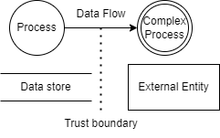
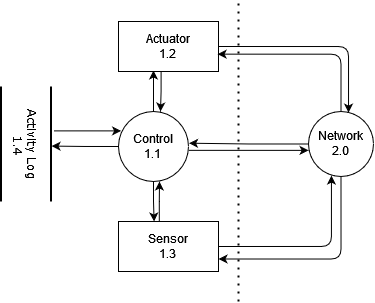
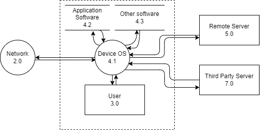

# Threat models for vulnerability analysis of IoT devices for Manipulation of Demand attacks

---
[José Antonio Font](mailto:jafont@alu.comillas.edu), [Javier Jarauta](mailto:jjarauta@alu.comillas.edu), [Roberto Gesteira](rgesteira@comillas.edu), [Rafael Palacios](rafael.palacios@iit.comillas.edu), [Gregorio López](gllopez@comillas.edu)

Instituto de Investigación Tecnológica - Universidad Pontificia Comillas
Madrid
---

  
   

---
### Abstract

The development of Internet of Things technologies has brought,  along with new opportunities, new types of risks to the table. This is exemplified by attacks like the distributed denial of service from the botnet Mirai. One of those risks comes from grid-connected high power devices. In this attack scenario, an attacker could gather a significant amount of smart devices to cause an noticeable impact on the power infrastructure. The goal of this paper is to define threat models, to help carry out vulnerability assessment on devices relevant to this attack scenario. This paper contains the development of said model for air conditioning, electric vehicle charging posts, and photovoltaic systems.

### DFD Items

- Circle: Process.
- Double circle: Complex Process.
- Rectangle: External entity.
- Two horizontal line: Data.
- Arrow: Data Flow.
- Dotted Line: Trust Boundary.

### HVAC DFDs

### EV Charging Stations DFD

### PV System DFD

### Future (Current) Work and conclusions

- Develop Device Specific DFD.
- Test devices.
- Threat model has helped identify tests and find vulnerabilities and generate reports.

#### EV Charger
- Develop attacks by means of the DFD
- Evaluate the EV charging station security
